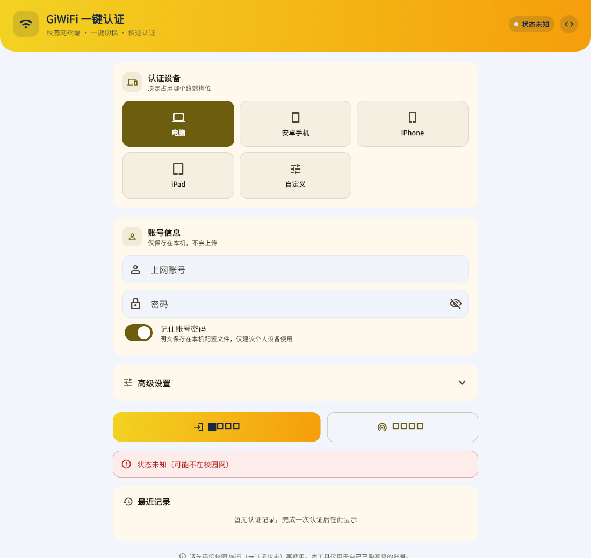
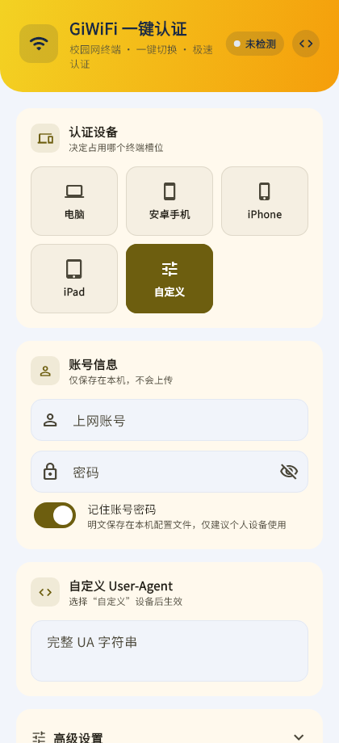

# GiWiFi 一键认证专门适配岭南师范学院

Flutter 桌面/移动端工具：**一键切换设备 User-Agent 完成校园网认证以及校园的设备的认证伪装**，解决多终端（电脑 / 手机 / 平板）套餐三端设备槽位切换麻烦的问题，以及解决了一个端只能一种设备设用的难题，比如你可以用平板端伪装成电脑端进行使用，防止了校园网的浪费，

GiWiFi 门户在渲染登录页时按请求的 User-Agent 生成 `device_type` / `device_os_type` / `is_mobile` 等隐藏字段，认证后把设备计入对应终端槽位。本工具在拉取登录页和提交认证时使用你选择的 UA，即可决定占用哪个槽位——不用改浏览器 UA，不用换设备。

## 界面预览

桌面版（Windows）：



手机版（420px 宽度，自定义 UA 面板展开）：



> 截图由 `test/screenshot_test.dart` 金色测试自动生成（使用仓库内子集化的 Noto Sans SC / MaterialIcons 字体渲染），UI 改版后运行
> `flutter test --update-goldens test/screenshot_test.dart` 即可同步更新。

## 功能

- **设备类型一键切换**：电脑 / 安卓手机 / iPhone / iPad / 安卓平板 / 自定义 UA，选中即生效
- **账号密码本地保存**（可关闭），下次打开自动填充（Android 使用应用专属持久化目录）
- **一键认证**：拉取登录页 → 解析隐藏字段 → AES 加密 → 提交，一次点击完成；遇到“更换绑定设备”提示时弹窗确认，自动完成换绑 → 6 秒冷却 → 二次认证
- **在线自动切换设备**：当前设备已在线时点击认证，会自动注销下线并按所选设备类型重新认证（无需手动先下线）
- **移动端 UA 自动适配**：手机/平板 UA 请求登录页时自动携带 `pagetype=login` 参数获取真正的登录表单
- **在线状态检查** + 页头状态徽章（已认证 / 未认证 / 状态未知）
- **在线时长显示**：认证成功后自动查询并显示当前在线时长（HH:MM:SS）
- **断线自动重连**：每 60 秒检测，掉线自动用当前设备类型重新认证
- **本地认证日志**：最近 50 条记录，成功失败一目了然
- 浅色 / 深色主题跟随系统

## 认证协议

与门户页 JS 完全一致：

1. GET `http://100.100.9.2/gportal/web/login`（带所选 UA）取隐藏字段 `iv`、`sign` 等
2. 表单按固定顺序序列化（`%xx` 编码）
3. AES-128-CBC + ZeroPadding 加密（密钥硬编码于门户 aes.js：`1234567887654321`），Base64
4. POST `/gportal/Web/loginAction`，body `{data, iv}`
5. 返回 `resultCode=124` 时：弹窗展示服务器提示，确认后 POST `resultData` 提交换绑，等待 6 秒冷却
6. 冷却结束自动重新认证；`status=1` 后查询 `/gportal/web/logout` 解析在线时长
7. 移动端 UA 首次请求若拿到的是无表单的引导页，自动改用 `?is_mobile=1&pagetype=login&logintype=1` 获取登录表单
8. 已在线时点击认证：自动 GET `/gportal/web/logout` 取 `si`，POST `/gportal/Web/logoutAction` 注销后重新走 1-6 步

整个流程复用同一 HttpClient 会话（Cookie 自动携带），与浏览器行为一致。

加密为**纯 Dart 实现**（FIPS-197，零第三方依赖），正确性由三层验证保证：

- NIST SP 800-38A 官方向量
- 与 pycryptodome / .NET 参考实现对拍（真实门户会话数据）
- `flutter test` + `dart run tool/selfcheck.dart` 全量回归

## 使用

1. 连接校园 WiFi（未认证状态）
2. 填上网账号和密码（勾选“记住”会保存在本机）
3. 点选设备类型，点击“一键认证”
4. 若弹出“确认更换绑定设备”，点击“确认换绑”后应用会等待 6 秒冷却并自动再次认证
5. 看到“认证成功，当前在线时长 XX”即上线；可在高级设置里开启断线自动重连

## 安全与注意事项

- **仅用于自己已购套餐的账号**，请遵守学校网络管理规定。
- Windows 密码保存在 `%APPDATA%\giwifi_ua_switcher\settings.json`；Android 等平台保存在系统应用支持目录的 `settings.json`。当前为本地明文配置，仅建议在个人设备使用，**不要将配置文件外传或提交到 Git**。
- 本工具不上传任何数据：全部请求只发往你在“高级设置”里填写的认证服务器（默认 `http://100.100.9.2`）。
- 认证服务器地址、密钥均为公开门户页面内嵌值，本仓库不含任何个人凭据。
- 若门户页面改版（字段名变化），认证会报“缺少 iv/sign 参数”，届时按新页面更新 `lib/utils/form_builder.dart` 与 `lib/services/auth_service.dart`。
- Android 构建需要 Android SDK；Gradle 对含中文的项目路径兼容性差，如遇构建失败把项目复制到全英文路径再试。
- 预设 UA 仅供参考，如某个槽位识别不对，用“自定义”粘贴你实测有效的 UA。

## 目录结构

```
lib/
  main.dart                    应用入口
  theme.dart                   品牌色 / 全局主题（浅色+深色）
  models/device_profile.dart   UA 预设
  pages/home_page.dart         主界面
  services/auth_service.dart   认证客户端（拉页/组装/加密/POST，dart:io）
  services/settings_service.dart 设置与日志持久化（JSON 文件）
  utils/aes_crypto.dart        纯 Dart AES-128-CBC + ZeroPadding
  utils/form_builder.dart      表单字段顺序与序列化
  utils/html_parser.dart       hidden input 解析
test/
  aes_crypto_test.dart         加密对拍（NIST + 真实向量）
  form_builder_test.dart       解析与序列化
  auth_flow_test.dart          完整链路对拍
  widget_test.dart             UI 冒烟测试
  screenshot_test.dart         金色截图测试（README 预览图来源）
  fonts/                       截图测试用子集字体（OFL / Apache-2.0）
  goldens/                     截图存档
tool/
  selfcheck.dart               独立自检（dart run 直接跑）
  gen_test_vectors.py          重新生成对拍向量（需 Python + pycryptodome）
  make_test_fonts.py           重新生成截图测试字体（需 fonttools）
  make_app_icons.py            重新生成应用图标（需 pillow）
  vectors.json                 当前对拍向量存档
```

## 许可

代码以 [MIT License](LICENSE) 开源。界面字体为小米 MiSans（免费商用，见 [assets/fonts/LICENSE-MiSans.txt](assets/fonts/LICENSE-MiSans.txt)）；截图测试字体为 Noto Sans SC（SIL OFL 1.1）与 MaterialIcons（Apache 2.0）的子集，仅用于测试，详见 [test/fonts/LICENSE.txt](test/fonts/LICENSE.txt)。

本工具仅供技术学习与个人使用，一切风险与后果由使用者自行承担。
